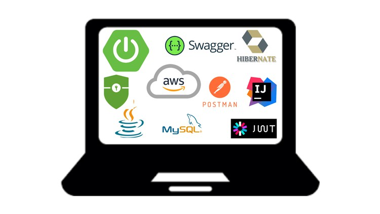

# Descripción del Proyecto

Este proyecto implica el desarrollo de una *Aplicación de Blog* utilizando *Spring Boot*. La aplicación cuenta con un backend robusto con puntos finales de API RESTful, permitiendo a los usuarios realizar operaciones CRUD sobre publicaciones de blog, comentarios y perfiles de usuario.

## Características Principales

- *CRUD Completo:* Los usuarios pueden crear, leer, actualizar y eliminar publicaciones de blog, así como comentarios y perfiles de usuario.

- *Seguridad:* Los puntos finales de la API están asegurados con *Spring Security y JWT* para la autenticación y autorización, asegurando que solo los usuarios autorizados puedan acceder a ciertas operaciones basadas en sus roles.

## Tecnologías Utilizadas

- Spring Boot
- Spring Security
- JSON Web Token (JWT)
- JPA
- Hibernate

## Operaciones Soportadas

La API soporta diversas operaciones, incluyendo pero no limitado a:

- *Publicaciones de Blog:* Los usuarios pueden crear, leer, actualizar y eliminar publicaciones.
- *Comentarios:* Los usuarios pueden agregar, ver y eliminar comentarios en las publicaciones.
- *Perfiles de Usuario:* Los usuarios pueden crear y actualizar sus perfiles.

## Seguridad y Autorización

- *Autenticación:* Utilizamos JWT para verificar la identidad de los usuarios.
- *Autorización:* Spring Security se utiliza para restringir el acceso a ciertas operaciones basadas en el rol del usuario.
